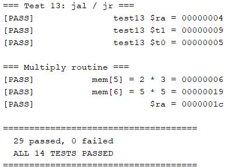
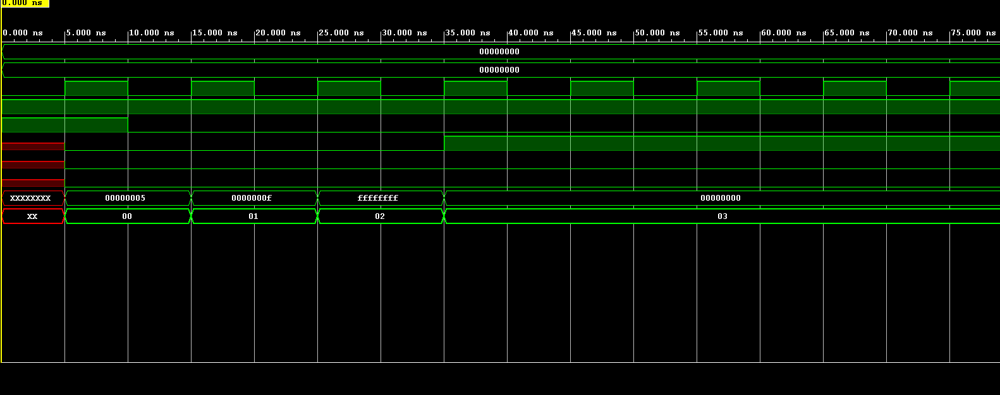
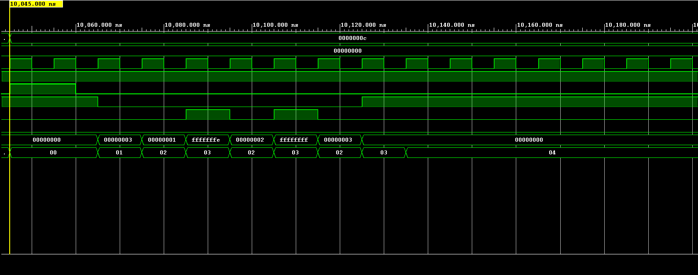
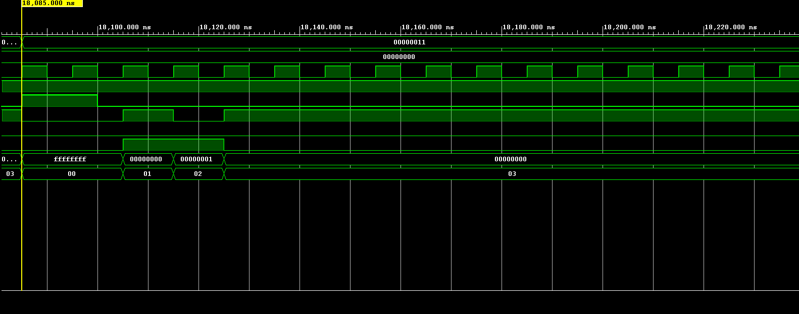
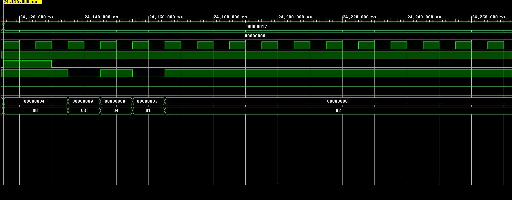
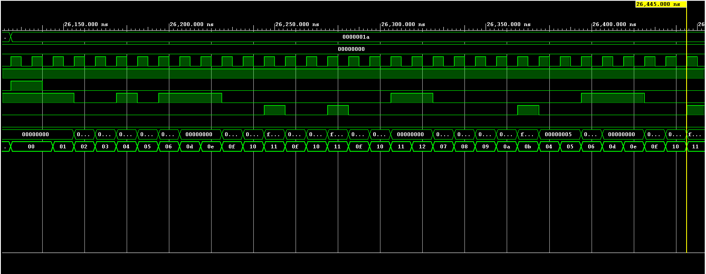
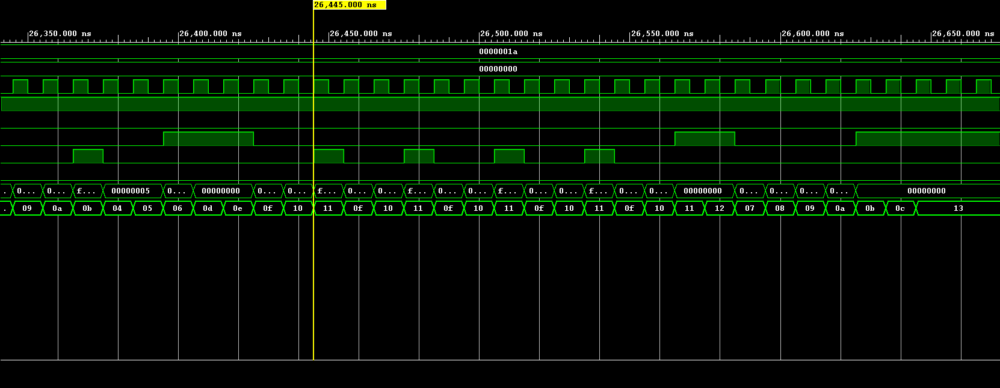

# MIPS-Architecture-SystemVerilog
A single-cycle MIPS architecture written in SystemVerilog — simulated and synthesized in Vivado, targeting the Basys 3 FPGA. On-board implementation in progress.

## Project Overview
---
This project designs a Harvard-style, single-cycle Microprocessor without Interlocked Pipeline Stages (MIPS) computer architecture. Using SystemVerilog, part of the MIPS instruction set architecture (ISA) is reconstructed, including critical R-type, I-type, and J-type instructions. It is simulated and verified in Vivado, with synthesis targeting the Basys 3 FPGA board; on-board implementation and hardware verification are in progress.

## Repository Structure
---
```
├── rtl/                  # SystemVerilog source
├── sim/
│   ├── TopLevel_tb.sv     # self-checking regression testbench
│   └── programs/          # $readmemh-loadable test programs
├── docs/                  # datapath diagram, waveform captures
└── constraints/           # Basys 3 .xdc
```

## Getting Started
---
1. Open the project in Vivado.
2. Set `sim/TopLevel_tb.sv` as the simulation top.
3. Test programs are loaded via `$readmemh` with paths defined at the top of the testbench (see the `` `DIR `` macro) — update these to match your local clone location before running.
4. Run Behavioral Simulation, then `run all` in the Tcl console.

## Single-Cycle MIPS Processor Datapath
---


This datapath can be dissected into six sections by use:
1. Program Counter and Instruction Memory
2. Register File
3. Control
4. Arithmetic Logic Unit (ALU)
5. Data Memory
6. Next Instruction Logic

### Program Counter and Instruction Memory
This unit keeps track of the program counter — where in the instruction sequence the processor currently is. On each rising clock edge, the PC loads the next address, and the instruction memory combinationally outputs the corresponding instruction.

MIPS uses 32-bit addressing, so both addresses and instructions are 32 bits wide. The instruction memory uses part of the current address to fetch the current instruction. The same bits are output as PCout, to display the current instruction count.

### Register File
This unit stores data for the running program as 32-bit registers, accessible by any instruction that needs them (`j` doesn't need register values, but `add` does). Following the MIPS ISA, register 0 is hardwired to zero and cannot be written; the remaining registers each have a conventional use case.

The register file's defining trait is its fast, direct addressing: its address comes straight from the instruction fields, with no calculation needed. Up to two registers can be read, and one written, per instruction.

### Control
The control units, highlighted light blue in the diagram, decode the current instruction to tell the other units what to do.

The unit titled `control` takes in the top 6 bits of the current instruction — the opcode — and uses it to determine what each unit is supposed to do. It isn't directly connected to every part, though. It talks directly to the register file, the data memory unit, and several muxes, but hands off some decisions to other control units. It tells the ALU control which operation is happening, and the ALU control then tells the ALU what to do. Similarly, the branch logic tells the branch-select mux whether to take the branch.

## Control Truth Table

| Opcode  | Instruction | ALUOp | ALUCntl  | Notes |
|---------|-------------|-------|----------|-------|
| 000000  | R-type      | 010   |see below | funct decides operation |
| 100011  | lw          | 000   | 0100     | ALUOp=000 → add |
| 101011  | sw          | 000   | 0100     | ALUOp=000 → add |
| 000100  | beq         | 001   | 0110     | subtract, compare Zero |
| 000101  | bne         | 001   | 0110     | subtract, compare Zero |
| 001000  | addi        | 000   | 0100     | sign-extended imm |
| 001001  | addiu       | 011   | 0101     | no overflow trap |
| 001100  | andi        | 100   | 0000     | sign-extends imm (not zero-ext) |
| 001101  | ori         | 101   | 0001     | sign-extends imm (not zero-ext) |
| 001010  | slti        | 110   | 1010     | signed compare |
| 001011  | sltiu       | 111   | 1011     | unsigned compare |
| 000010  | j           | 000   | —        | ALU unused |
| 000011  | jal         | 000   | —        | ALU unused, $ra ← PC+4 |

### R-type funct decode (Opcode = 000000, ALUOp = 010)

| Funct  | Instruction | ALUCntl |
|--------|-------------|---------|
| 100000 | add         | 0100    |
| 100001 | addu        | 0101    |
| 100010 | sub         | 0110    |
| 100011 | subu        | 0111    |
| 100100 | and         | 0000    |
| 100101 | or          | 0001    |
| 100110 | xor         | 0010    |
| 100111 | nor         | 0011    |
| 000000 | sll         | 1000    |
| 000010 | srl         | 1001    |
| 101010 | slt         | 1010    |
| 101011 | sltu        | 1011    |
| 001000 | jr          | — (unhandled) |

### Control Signals

| Opcode | Instruction | RegDst | ALUSrc | MemtoReg | RegWrite | MemRead | MemWrite | Branch | ALUOp |
|--------|-------------|--------|--------|----------|----------|---------|----------|--------|-------|
| 000000 | R-type      | 01     | 0      | 00       | 1        | 0       | 0        | 00     | 010   |
| 100011 | lw          | 00     | 1      | 01       | 1        | 1       | 0        | 00     | 000   |
| 101011 | sw          | 00     | 1      | 00       | 0        | 0       | 1        | 00     | 000   |
| 000100 | beq         | 00     | 0      | 00       | 0        | 0       | 0        | 01     | 001   |
| 000101 | bne         | 00     | 0      | 00       | 0        | 0       | 0        | 10     | 001   |
| 001000 | addi        | 00     | 1      | 00       | 1        | 0       | 0        | 00     | 000   |
| 001001 | addiu       | 00     | 1      | 00       | 1        | 0       | 0        | 00     | 011   |
| 001100 | andi        | 00     | 1      | 00       | 1        | 0       | 0        | 00     | 100   |
| 001101 | ori         | 00     | 1      | 00       | 1        | 0       | 0        | 00     | 101   |
| 001010 | slti        | 00     | 1      | 00       | 1        | 0       | 0        | 00     | 110   |
| 001011 | sltiu       | 00     | 1      | 00       | 1        | 0       | 0        | 00     | 111   |
| 000010 | j           | 00     | 0      | 00       | 0        | 0       | 0        | 00     | 000   |
| 000011 | jal         | 10     | 0      | 10       | 1        | 0       | 0        | 00     | 000   |

`RegDst`: 00 = Rt, 01 = Rd, 10 = $ra (31)
`MemtoReg`: 00 = ALU result, 01 = memory read data, 10 = PC+4
`Branch`: 00 = none, 01 = branch on Zero (`beq`), 10 = branch on ~Zero (`bne`)

### Jump Logic (separate from `control`)

`jmpLogic` decodes `Opcode`/`Funct` independently to produce `JmpOut` (redirect PC to a jump target) and `JmpSrc` (select register vs. computed target):

| Condition                          | JmpOut | JmpSrc |
|-------------------------------------|--------|--------|
| Opcode = 000010 (`j`)                | 1      | 0      |
| Opcode = 000011 (`jal`)              | 1      | 0      |
| Opcode = 000000, Funct = 001000 (`jr`)| 1      | 1      |
| otherwise                            | 0      | 0      |

### ALU
The ALU calculates the three output flags regardless of the instruction, which isn't the usual case but isn't a concern for the scope of this project.

### Data Memory
Another data storage unit, like the register file, but with very different usage. It's intended for larger-scale, longer-term data, accessible only by the load-word and store-word instructions, with addresses calculated by the ALU.

### Next Instruction Logic
At the top of the diagram is a series of muxes, all used to determine the next instruction address. The PC adder simply increments the PC by 4. The jump target address logic computes where a `j`/`jal` instruction should jump to. The branch adder computes where a branch would go, while separate branch logic decides whether that branch is actually taken. The final two muxes then select which of these candidate addresses becomes the next PC value.

The jump target address logic includes a mux that chooses between the calculated address or an address from a register, for the `jr` case.

## Verification

The processor is verified with a self-checking SystemVerilog testbench (`sim/TopLevel_tb.sv`) against 13 targeted test programs, each isolating one instruction or datapath feature, plus the original multiply routine from the ECE 445 course project.

Test programs live in `sim/programs/` as `$readmemh`-loadable hex files, independent of the RTL.

```
=== Test 1: addi - sign extension ===
[PASS]               test01 $t0 = 00000005
[PASS]               test01 $t1 = 0000000f
[PASS]               test01 $t2 = ffffffff

=== Test 2: R-type add/sub ===
[PASS]               test02 $t2 = 0000000a
[PASS]               test02 $t3 = 00000004

=== Test 3: lw ===
[PASS]               test03 $t0 = 00000002
[PASS]               test03 $t1 = 00000003
[PASS]               test03 $t2 = 00000005

=== Test 4: sw ===
[PASS]               test04 $t1 = 00001234
[PASS]            test04 mem[8] = 00001234

=== Test 5: beq (taken, forward) ===
[PASS]               test05 $t2 = 00000000
[PASS]               test05 $t3 = 00000001

=== Test 6: bne (backward loop) ===
[PASS]               test06 $t0 = 00000003

=== Test 7: andi ===
[PASS]               test07 $t1 = 0000000f

=== Test 8: ori ===
[PASS]               test08 $t1 = 000000ff

=== Test 9: slti ===
[PASS]               test09 $t1 = 00000001
[PASS]               test09 $t2 = 00000000

=== Test 10: sltiu vs slti ===
[PASS]       test10 $t1 (sltiu) = 00000000
[PASS]        test10 $t2 (slti) = 00000001

=== Test 11: addiu ===
[PASS]               test11 $t0 = ffffffff
[PASS]               test11 $t1 = 00000005

=== Test 12: j ===
[PASS]               test12 $t0 = 00000001
[PASS]               test12 $t1 = 00000007

=== Test 13: jal / jr ===
[PASS]               test13 $ra = 00000004
[PASS]               test13 $t1 = 00000009
[PASS]               test13 $t0 = 00000005

=== Multiply routine ===
[PASS]           mem[5] = 2 * 3 = 00000006
[PASS]           mem[6] = 5 * 5 = 00000019
[PASS]                      $ra = 0000001c

=====================================
  29 passed, 0 failed
  ALL 14 TESTS PASSED
=====================================
```



### Test 01


```assembly
0x00  addi $t0,$zero,5
0x04  addi $t1,$t0,10
0x08  addi $t2,$zero,-1
0x0C  j 0x0C   (halt)
```
Loads a small positive immediate, adds another immediate to it, then loads a negative immediate and checks that it correctly extends to a full 32-bit `0xFFFFFFFF` rather than something like `0x0000FFFF`. Validates the `sign_ext` module in isolation — the very first piece of the datapath most other tests silently depend on.

`Dout=5` writing to `$t0`, then `Dout=15` writing to `$t1`, then `Dout=0xFFFFFFFF` writing to `$t2` — the third value being the one that actually proves sign extension rather than zero-padding.

### Test 06


```assembly
0x00  addi $t0,$zero,0
0x04  addi $t1,$zero,3
0x08  loop: addi $t0,$t0,1
0x0C  bne  $t0,$t1,loop
0x10  j 0x10   (halt)
```
Loops by branching backward to a lower address, using a negative immediate offset. Validates sign extension of the branch offset, the shift-left-2, the branch adder, and `branch_logic`'s taken/not-taken decision — together the most fragile chain in a MIPS datapath.

`PCout` oscillating between `0x08` and `0x0C` three times, with `$t0` incrementing `0 → 1 → 2 → 3` in lockstep on each pass, then falling through to the halt once `$t0` reaches `$t1`.

### Test 10


```assembly
0x00  addi  $t0,$zero,-1
0x04  sltiu $t1,$t0,1
0x08  slti  $t2,$t0,1
0x0C  j 0x0C   (halt)
```
Loads `-1` (`0xFFFFFFFF`) and compares it against `1` two ways — once unsigned, once signed — to confirm the ALU's comparison logic actually distinguishes the two rather than treating them identically. This is the test that caught a real bug: the `slt`/`sltu` encodings were originally swapped in `ALUcntl`.

Two back-to-back `Dout` values on the same operand — `0` for the unsigned comparison (`0xFFFFFFFF` is not less than `1` when read as a huge positive number) and `1` for the signed comparison (`-1` is less than `1`) — landing in `$t1` and `$t2` respectively.

### Test 13


```assembly
0x00  jal  SUB     (0x0C)
0x04  addi $t0,$zero,5
0x08  j 0x08   (halt)
0x0C  SUB: addi $t1,$zero,9
0x10  jr   $ra
```
A minimal call/return pair — no arguments, no computation in the subroutine beyond a marker instruction, isolating the jump-and-link mechanism from everything else. Validates `RegDst=10` (hardcoding the destination to `$ra`), `MemtoReg=10` (writing back `PC+4` instead of an ALU result), and `jmpSrcMux` selecting a register value over a computed target for `jr`.

`PCout` executing out of address order — `0x00 → 0x0C → 0x10 → 0x04 → 0x08` — with `Dout=0x04` latching into `$ra` at the `jal`, `$t1=9` set inside the subroutine, and `$t0=5` only executing after the return, proving `jr` actually redirected the PC back rather than falling through.

### Test 14 — Multiply routine (integration test)



```assembly
0x00  add  $t0,$zero,$zero
0x04  add  $t1,$zero,$zero
0x08  addi $t2,$zero,2
0x0C  addi $t3,$zero,20
0x10  lw   $a0,0($t0)
0x14  lw   $a1,4($t0)
0x18  jal  MULT        (0x34)
0x1C  sw   $v0,0($t3)
0x20  addi $t0,$t0,8
0x24  addi $t3,$t3,4
0x28  addi $t1,$t1,1
0x2C  bne  $t1,$t2,L1
0x30  j    DONE
0x34  MULT: add $s0,$zero,$zero
0x38  sub  $v0,$v0,$v0
0x3C  L2:  add $v0,$v0,$a0
0x40       addi $s0,$s0,1
0x44       bne  $s0,$a1,L2
0x48       jr   $ra
0x4C  DONE: nop
```
Computes 2×3 and 5×5 by repeated addition, using a subroutine reached with `jal`/`jr`. Exercises nearly the entire instruction set in one program — `lw`, `sw`, `add`, `sub`, `addi`, `bne`, `j`, `jal`, `jr` — and is the closest thing in the suite to a real program rather than a unit test.

`PCout` jumping non-sequentially from `0x18` to `0x34` on the `jal` (skipping over the `sw`), looping through `L2` three times while `$v0` accumulates `0 → 2 → 4 → 6`, then `jr` returning execution to `0x1C` — behind where the `jal` was originally issued — where the accumulated result is stored to `mem[5]`.

The same subroutine runs a second time with different operands (5×5), looping five times instead of three — demonstrating the loop bound (`$a1`) is read from data rather than fixed in the instruction stream.

`PCout` traces the full non-sequential control flow — the jump to `MULT` on `jal`, the loop repeating three times inside `L2`, and `jr` returning execution behind the original call site. The resulting values (`mem[5]=6`, `mem[6]=25`) are confirmed in the console output above rather than read directly off this waveform.

### Bugs found through testing

Verification surfaced several bugs that weren't visible from code review alone:

- `branch_logic` had no `default` case, producing X on any opcode that didn't branch — propagated into the PC mux select and corrupted every subsequent fetch.
- `ALUcntl`'s R-type decode used string literals (`"0000"`) instead of binary literals (`4'b0000`), silently truncating to garbage 4-bit values for most R-type operations.
- `slt`/`sltu` and `slti`/`sltiu` had their ALU encodings swapped — the "signed" and "unsigned" comparison paths were reversed.
- `RegFile` read `$zero` directly from an uninitialized array element rather than hardwiring it, producing X on any instruction that read register 0 before it was written.
- A typo in a port connection (`sigExtImm` vs. the declared `SignExtImm`) left the ALU's immediate input floating, corrupting every ALU result.

### Hardware Demo


https://github.com/user-attachments/assets/e7af661f-fc39-4cd8-b485-72b1568309cc


A single continuous run on the Basys 3: the multiply routine executing to
completion via manual instruction-stepping, `RST` clearing the processor
mid-program and restarting cleanly (twice, confirming the fix for the
clock/reset race described above), and the `Dout` digit-select button
toggling between the upper and lower 16 bits of a result on the 7-segment
display.

## Known Limitations

- **Both `InstMem` and `DataMem` are addressed with `Addr[6:2]`**, a 5-bit slice reaching only the first 32 of their 64 declared words. This caps total program size at 32 instructions (128 bytes) and data memory at 32 words, even though both arrays are declared 64 words deep. The longest test program (the multiply routine, 20 words) fits comfortably under this limit, but it's a real constraint on future test programs, not just an unused-memory curiosity.
- **`andi`/`ori` sign-extend their immediates** rather than zero-extending them, since both ALU-source paths share a single `sign_ext` module. Deviates from the MIPS spec, where logical immediates are zero-extended.
- **`add`/`addu` and `sub`/`subu` are functionally identical.** In the ISA, the only difference is that `add`/`sub` trap on signed overflow while `addu`/`subu` don't. This ALU exposes `Overflow` as a flag rather than trapping, so the distinction currently has no effect.
- **`Overflow` and `Carryout` are computed unconditionally** from the ALU's operands, regardless of which operation is selected — e.g. `Carryout` reports the carry of `A+B` even during a logical `AND`. Only meaningful to read during add/subtract operations.
- **`jr`'s funct code isn't decoded** by `ALUcntl` and falls through to a default ALU result. Harmless in practice, since `jr`'s ALU output is unused and its destination register decodes to `$zero`, but worth noting as an intentional gap rather than an oversight.
- **`RegFile` is fully reset on `RST`**, clearing all 32 registers. This is correct and necessary for consistent simulation, but prevents Vivado from inferring distributed RAM for the register file — it synthesizes as ~1024 flip-flops instead.
- **No arithmetic right shift (`sra`).** Only logical shifts (`sll`, `srl`) are implemented.
