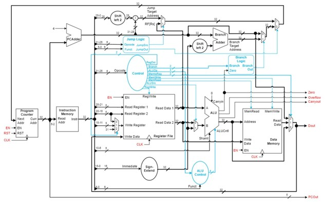
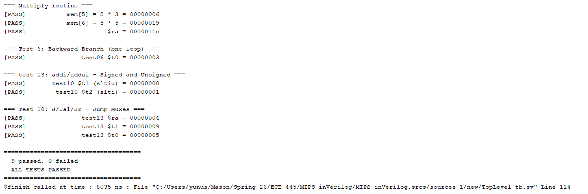

# MIPS-Architecture-SystemVerilog
A single-cycle MIPS architecture written in SystemVerilog — simulated, synthesized, and implemented with Vivado on the Basys 3.

## Project Overview
---
This project designs a Harvard-style, single-cycle Microprocessor without Interlocked Pipeline Stages (MIPS) computer architecture. Using SystemVerilog, part of the MIPS instruction set architecture (ISA) is reconstructed, including critical R-type, I-type, and J-type instructions. It is then simulated and verified in Vivado, and finally implemented on the Basys 3 FPGA board.

## Single-Cycle MIPS Processor Datapath
---

This datapath can be dissected into six sections by use:
1. Program Counter and Instruction Memory
2. Register File
3. Control
4. Arithmetic Logic Unit (ALU)
5. Data Memory
6. Next Instruction Logic

### Program Counter and Instruction Memory
This unit keeps track of the program counter — where in the instruction sequence the processor currently is. On each rising clock edge, the PC loads the next address, and the instruction memory combinationally outputs the corresponding instruction.

MIPS uses 32-bit addressing, so both addresses and instructions are 32 bits wide. The instruction memory uses part of the current address to fetch the current instruction. The same bits are output as PCout, to display the current instruction count.

### Register File
This unit stores data for the running program as 32-bit registers, accessible by any instruction that needs them (`j` doesn't need register values, but `add` does). Following the MIPS ISA, register 0 is hardwired to zero and cannot be written; the remaining registers each have a conventional use case.

The register file's defining trait is its fast, direct addressing: its address comes straight from the instruction fields, with no calculation needed. Up to two registers can be read, and one written, per instruction.

### Control
The control units, highlighted light blue in the diagram, decode the current instruction to tell the other units what to do.

The unit titled `control` takes in the top 6 bits of the current instruction — the opcode — and uses it to determine what each unit is supposed to do. It isn't directly connected to every part, though. It talks directly to the register file, the data memory unit, and several muxes, but hands off some decisions to other control units. It tells the ALU control which operation is happening, and the ALU control then tells the ALU what to do. Similarly, the branch logic tells the branch-select mux whether to take the branch.

## Control Truth Table

| Opcode  | Instruction | ALUOp | ALUCntl  | Notes |
|---------|-------------|-------|----------|-------|
| 000000  | R-type      | 010   |see below | funct decides operation |
| 100011  | lw          | 000   | 0100     | ALUOp=000 → add |
| 101011  | sw          | 000   | 0100     | ALUOp=000 → add |
| 000100  | beq         | 001   | 0110     | subtract, compare Zero |
| 000101  | bne         | 001   | 0110     | subtract, compare Zero |
| 001000  | addi        | 000   | 0100     | sign-extended imm |
| 001001  | addiu       | 011   | 0101     | no overflow trap |
| 001100  | andi        | 100   | 0000     | sign-extends imm (not zero-ext) |
| 001101  | ori         | 101   | 0001     | sign-extends imm (not zero-ext) |
| 001010  | slti        | 110   | 1010     | signed compare |
| 001011  | sltiu       | 111   | 1011     | unsigned compare |
| 000010  | j           | 000   | —        | ALU unused |
| 000011  | jal         | 000   | —        | ALU unused, $ra ← PC+4 |

 
### R-type funct decode (Opcode = 000000, ALUOp = 010)

| Funct  | Instruction | ALUCntl |
|--------|-------------|---------|
| 100000 | add         | 0100    |
| 100001 | addu        | 0101    |
| 100010 | sub         | 0110    |
| 100011 | subu        | 0111    |
| 100100 | and         | 0000    |
| 100101 | or          | 0001    |
| 100110 | xor         | 0010    |
| 100111 | nor         | 0011    |
| 000000 | sll         | 1000    |
| 000010 | srl         | 1001    |
| 101010 | slt         | 1010    |
| 101011 | sltu        | 1011    |
| 001000 | jr          | — (unhandled) |

### Control Signals

| Opcode | Instruction | RegDst | ALUSrc | MemtoReg | RegWrite | MemRead | MemWrite | Branch | ALUOp |
|--------|-------------|--------|--------|----------|----------|---------|----------|--------|-------|
| 000000 | R-type      | 01     | 0      | 00       | 1        | 0       | 0        | 00     | 010   |
| 100011 | lw          | 00     | 1      | 01       | 1        | 1       | 0        | 00     | 000   |
| 101011 | sw          | 00     | 1      | 00       | 0        | 0       | 1        | 00     | 000   |
| 000100 | beq         | 00     | 0      | 00       | 0        | 0       | 0        | 01     | 001   |
| 000101 | bne         | 00     | 0      | 00       | 0        | 0       | 0        | 10     | 001   |
| 001000 | addi        | 00     | 1      | 00       | 1        | 0       | 0        | 00     | 000   |
| 001001 | addiu       | 00     | 1      | 00       | 1        | 0       | 0        | 00     | 011   |
| 001100 | andi        | 00     | 1      | 00       | 1        | 0       | 0        | 00     | 100   |
| 001101 | ori         | 00     | 1      | 00       | 1        | 0       | 0        | 00     | 101   |
| 001010 | slti        | 00     | 1      | 00       | 1        | 0       | 0        | 00     | 110   |
| 001011 | sltiu       | 00     | 1      | 00       | 1        | 0       | 0        | 00     | 111   |
| 000010 | j           | 00     | 0      | 00       | 0        | 0       | 0        | 00     | 000   |
| 000011 | jal         | 10     | 0      | 10       | 1        | 0       | 0        | 00     | 000   |

`RegDst`: 00 = Rt, 01 = Rd, 10 = $ra (31)
`MemtoReg`: 00 = ALU result, 01 = memory read data, 10 = PC+4
`Branch`: 00 = none, 01 = branch on Zero (`beq`), 10 = branch on ~Zero (`bne`)

### Jump Logic (separate from `control`)

`jmpLogic` decodes `Opcode`/`Funct` independently to produce `JmpOut` (redirect PC to a jump target) and `JmpSrc` (select register vs. computed target):

| Condition                          | JmpOut | JmpSrc |
|-------------------------------------|--------|--------|
| Opcode = 000010 (`j`)                | 1      | 0      |
| Opcode = 000011 (`jal`)              | 1      | 0      |
| Opcode = 000000, Funct = 001000 (`jr`)| 1      | 1      |
| otherwise                            | 0      | 0      |

### ALU
The ALU calculates the three output flags regardless of the instruction, which isn't the usual case but isn't a concern for the scope of this project.

### Data Memory
Another data storage unit, like the register file, but with very different usage. It's intended for larger-scale, longer-term data, accessible only by the load-word and store-word instructions, with addresses calculated by the ALU.

### Next Instruction Logic
At the top of the diagram is a series of muxes, all used to determine the next instruction address. The PC adder simply increments the PC by 4. The jump target address logic computes where a `j`/`jal` instruction should jump to. The branch adder computes where a branch would go, while separate branch logic decides whether that branch is actually taken. The final two muxes then select which of these candidate addresses becomes the next PC value.

The jump target address logic includes a mux that chooses between the calculated address or an address from a register, for the jr case.

## Verification

The processor is verified with a self-checking SystemVerilog testbench (`sim/TopLevel_tb.sv`) against 13 targeted test programs, each isolating one instruction or datapath feature, plus the original multiply routine from the ECE 445 course project.

Test programs live in `sim/programs/` as `$readmemh`-loadable hex files, independent of the RTL.

### Bugs found through testing

Verification surfaced several bugs that weren't visible from code review alone:

- `branch_logic` had no `default` case, producing X on any opcode that didn't branch — propagated into the PC mux select and corrupted every subsequent fetch.
- `ALUcntl`'s R-type decode used string literals (`"0000"`) instead of binary literals (`4'b0000`), silently truncating to garbage 4-bit values for most R-type operations.
- `slt`/`sltu` and `slti`/`sltiu` had their ALU encodings swapped — the "signed" and "unsigned" comparison paths were reversed.
- `RegFile` read `$zero` directly from an uninitialized array element rather than hardwiring it, producing X on any instruction that read register 0 before it was written.
- A typo in a port connection (`sigExtImm` vs. the declared `SignExtImm`) left the ALU's immediate input floating, corrupting every ALU result.

## Known Limitations

- **`andi`/`ori` sign-extend their immediates** rather than zero-extending them, since both ALU-source paths share a single `sign_ext` module. Deviates from the MIPS spec, where logical immediates are zero-extended.
- **`add`/`addu` and `sub`/`subu` are functionally identical.** In the ISA, the only difference is that `add`/`sub` trap on signed overflow while `addu`/`subu` don't. This ALU exposes `Overflow` as a flag rather than trapping, so the distinction currently has no effect.
- **`Overflow` and `Carryout` are computed unconditionally** from the ALU's operands, regardless of which operation is selected — e.g. `Carryout` reports the carry of `A+B` even during a logical `AND`. Only meaningful to read during add/subtract operations.
- **`DataMem` is addressed with `Addr[6:2]`**, reaching only the first 32 of its 64 declared words. `InstMem` uses `Addr[7:2]` and reaches the full 64.
- **`jr`'s funct code isn't decoded** by `ALUcntl` and falls through to a default ALU result. Harmless in practice, since `jr`'s ALU output is unused and its destination register decodes to `$zero`, but worth noting as an intentional gap rather than an oversight.
- **`RegFile` is fully reset on `RST`**, clearing all 32 registers. This is correct and necessary for consistent simulation, but prevents Vivado from inferring distributed RAM for the register file — it synthesizes as ~1024 flip-flops instead.
- **No arithmetic right shift (`sra`).** Only logical shifts (`sll`, `srl`) are implemented.